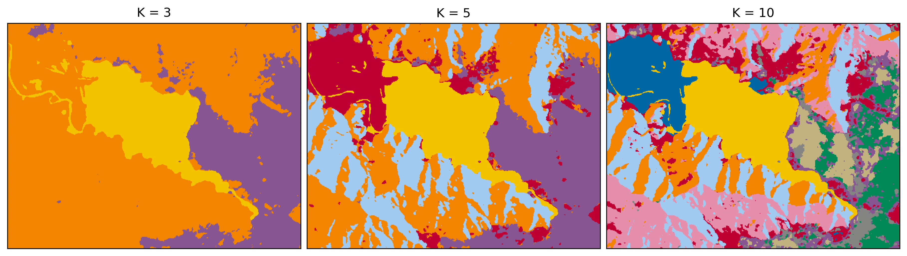
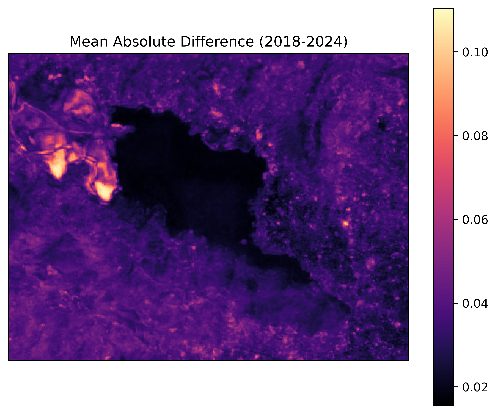

# Revolutionizing Land Cover Analysis with Google Satellite Embeddings and Python

A Python repo for analyzing satellite imagery using Google Earth Engine embeddings. This package provides tools for k-means clustering and change detection analysis with clear visualizations.

[](https://www.python.org/downloads/)
[](https://opensource.org/licenses/MIT)

## Features

- **Satellite Embeddings**: Load and process Google Earth Engine satellite embeddings
- **Clustering Analysis**: K-means clustering with sensible defaults and diagnostics
- **Change Detection**: Temporal analysis using mean absolute difference and cosine similarity
- **Visualization**: Interactive maps and publication-quality static visualizations
- **Smart Sampling**: Efficient sampling strategies for large imagery datasets

## Earth Engine Setup

Before using this package, you need to:

1. Create a Google Earth Engine account at https://earthengine.google.com
2. Authenticate Earth Engine:
   ```python
   import ee
   ee.Authenticate()
   ```
3. Set your Earth Engine project ID when initializing

## Installation

### From source

```bash
git clone https://github.com/milos-agathon/google-satellite-embeddings-python.git
cd google-satellite-embeddings-python
pip install -e .
```

## Examples

### PART I: CLUSTERING ANALYSIS

Demonstrates unsupervised classification of satellite embeddings using k-means clustering.



### PART II: CHANGE DETECTION ANALYSIS

Demonstrates temporal analysis using satellite embeddings to detect changes between 2018 and 2024.



See the [examples directory](examples/) for complete Jupyter notebook demonstrations.

## Requirements

- Python 3.8+
- earthengine-api >= 0.1.300
- geemap >= 0.20.0
- folium >= 0.14.0
- rasterio >= 1.3.0
- numpy >= 1.20.0
- matplotlib >= 3.5.0

## Citation

If you use this package in your research, please cite:

```bibtex
@software{popovic2024satellite,
  author = {Popovic, Milos},
  title = {Google Satellite Embeddings Python Package},
  year = {2024},
  url = {https://github.com/milos-agathon/google-satellite-embeddings-python}
}
```

## Credits

Created with ☕ by **Milos Popovic** • [YouTube channel](https://www.youtube.com/@milos-makes-maps) – subscribe for more GIS tutorials.

## Acknowledgments

This package uses Google Earth Engine's satellite embedding dataset and the excellent geemap library for Earth Engine integration.
